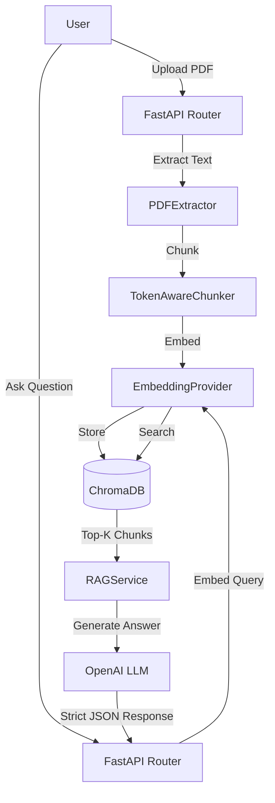

# Architecture

## Overview
This document outlines the architecture of the AI-Powered Document Q&A Service.

### High-Level Flow
1. **Ingestion**: A user uploads a PDF document.
2. **Extraction & Chunking**: The system extracts text and metadata, and chunks it into smaller tokens using `tiktoken`.
3. **Embedding**: The chunks are embedded using OpenAI's embedding model.
4. **Storage**: Vectors and metadata are stored in a ChromaDB collection.
5. **Retrieval**: A user asks a question, it is embedded, and the closest chunks are retrieved.
6. **Generation**: The LLM generates an answer strictly based on the retrieved chunks, providing citations.

## Clean Architecture Principles
- **Domain**: Interfaces (`VectorStoreRepository`, `EmbeddingProvider`) are defined to decouple the core logic from specific implementations.
- **Infrastructure**: Implementations like `OpenAIEmbeddingProvider` and `ChromaVectorStore` are injected or retrieved via factory methods.
- **Services**: `RAGService` orchestrates the flow without knowing the underlying implementation details.

## Mermaid Architecture Diagram

